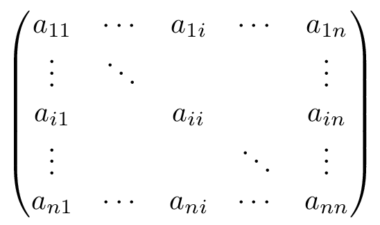
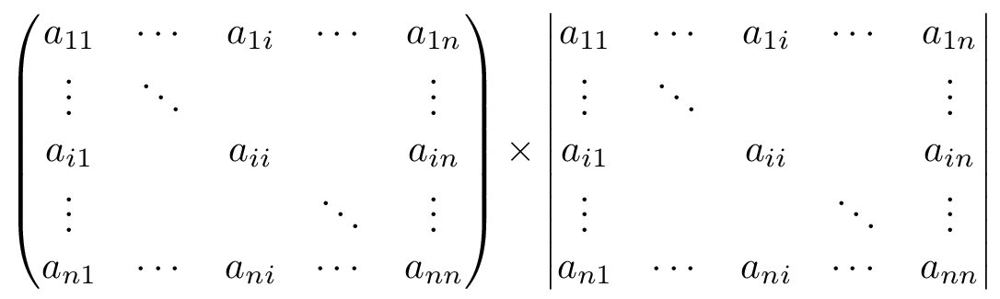

***
# Python install
Note: Please use python3.x! (currently I have used python 3.7 on 2020/04/11)

1) Original methods  
https://realpython.com/installing-python/#step-1-download-the-python-3-installer  
https://packaging.python.org/tutorials/installing-packages/  

2) By Anaconda packages  
https://docs.anaconda.com/anaconda/install/  
 
***
Recently the installation by the Anaconda package is getting popular. Especially for novice engineers toward data scientists. It is because python modules related to data science will be installed simultaneously.

https://docs.anaconda.com/anaconda/packages/pkg-docs/

For Japanese:
AnacondaでPython3をインストール(Windows/Mac編) (ai-inter1.com) 
https://ai-inter1.com/python-install/
\ Anaconda、Jupyter Notebookを利用したPython3の環境構築方法を初心者向けに解説した記事
 
***
## Guide & tutorial for python learners:
w3chools.com is very kind for learners of various programming languages.
Python Tutorial is also fine for you.
https://www.w3schools.com/python/


### Python Tutorial in w3schools.com
Well organized and easy to understand Web building tutorials with lots of examples of how to use HTML, CSS, JavaScript, SQL, PHP, Python, Bootstrap, Java and XML.

You can find a method of how to use some specific command, funciton and data structures.

#### Python Lists in w3schools.com
Well organized and easy to understand Web building tutorials with lots of examples of how to use HTML, CSS, JavaScript, SQL, PHP, Python, Bootstrap, Java and XML.

https://www.w3schools.com/python/python_lists.asp


#### Python Tryit Editor v1.0 (w3schools.com)
This is an example of how to use “list” in python.
You can push the green button “Try it Yourself” and try to run the code in the web browser even without the installation.

https://www.w3schools.com/python/trypython.asp?filename=demo_list


***
## An example 
This is a sample code to use the list:

fruits = [‘strawberry’, ‘grape’, ‘tomato’];

print(fruits);

## What does mathematics we learn?

This is a matrix   
(TeX format)
\begin{pmatrix}
a{11} & \cdots & a{1i} & \cdots & a{1n}\
\vdots & \ddots &       &       & \vdots \
a{i1} &       & a{ii} &       & a{in} \
\vdots &       &       & \ddots & \vdots \
a{n1} & \cdots & a{ni} & \cdots & a_{nn}
\end{pmatrix} 



and we need to treat the operation as follows:
 (TeX format)
\begin{pmatrix}
a{11} & \cdots & a{1i} & \cdots & a{1n}\
\vdots & \ddots &        &        & \vdots \
a{i1} &        & a{ii} &        & a{in} \
\vdots &        &        & \ddots & \vdots \
a{n1} & \cdots & a{ni} & \cdots & a{nn}
\end{pmatrix}
\times
\begin{vmatrix}
a{11} & \cdots & a{1i} & \cdots & a{1n}\
\vdots & \ddots &        &        & \vdots \
a{i1} &        & a{ii} &        & a{in} \
\vdots &        &        & \ddots & \vdots \
a{n1} & \cdots & a{ni} & \cdots & a{nn}
\end{vmatrix} (posted by waga)



 
***
# Introduction: Lecture 1

Let’s start the course!

Let us start this lecture course. I offer tutorials in the aim of training  to contribute to enhance knowledge, abilities and skills toward data science such as solving optimization problems, biological data analyses, risk management and so on. In this aim, I need to emphasize the necessity of learning about matrix operation i.e. Linear algebra. In the case of Python programming, it means that you need python modules callded “numpy” (for matrix operations/linear algebra) and “panda” (statistics), which are already included in the anaconda package.  

*A Complete Beginners Guide to Matrix Multiplication for Data Science with Python Numpy
Learn matrix multiplication for machine learning* 
https://towardsdatascience.com/a-complete-beginners-guide-to-matrix-multiplication-for-data-science-with-python-numpy-9274ecfc1dc6
 
***
How to reinstall modules (English)

If you have a trouble for updating  “numpy” and “panda” modules, you can see webpages to deal with the issues.  

*Stack Overflow*
*How to install numpy on windows using pip install?
I want to install numpy using pip install numpy command but i get follwing error: RuntimeError: Broken toolchain: cannot link a simple C program I'm using windows 7 32bit, python 2.7.9, pip 6.1.1...*  
https://stackoverflow.com/questions/29499815/how-to-install-numpy-on-windows-using-pip-install

***
How to reinstall modules (Japanese)

For Japanese (or you can use Google chrome with English translation mode):

*Qiita: AnacondaやAnaconda経由でPandas、numpyなどのパッケージをアップデートする方法 - Qiita*  
https://qiita.com/i_jp/items/7f1bc432b262b11ff8fc
 
***
Or other serious trouble fix method:

*Qiita: Anacondaでnumpy, pandasをimportできなくなったら - Qiita*  
 https://qiita.com/holygo/items/1644586ff283408b28e2
 
***
## Step1

Please check whether a python compiler was successfully installed in your computer, by using the following code:
https://github.com/hirowgit/2A_python_basic_course/blob/master/lec1_step1.py#L25-L26

lec1_step1.py:25-26
<pre><code>fruits = ['strawberry', 'grape', 'tomato'];  
print(fruits); </code></pre>
 <a href="https://github.com/hirowgit/2A_python_basic_course">hirowgit/2A_python_basic_course</a>


Here is the result. If you can see the same result in your PC, the installation process was done successfully.
https://github.com/hirowgit/2A_python_basic_course/blob/master/lec1_step1/lec1_step1.txt#L32

lec1_step1/lec1_step1.txt:32
<pre><code>['strawberry', 'grape', 'tomato'] </code></pre>
 <a href="https://github.com/hirowgit/2A_python_basic_course">hirowgit/2A_python_basic_course</a>

***
### Note: 
tomato is a vegetable but types of tomato in some countries like Japan and Korea are very sweet and the sugar content is high like fruits.

*Japanese Momotaro Tomatoes (specialtyproduce.com)* 
*The Japanese Momotaro tomato is an oblate-shaped hybrid that typically weighs between six and seven ounces. Its skin is thick and pink with green shoulders around...*  
https://specialtyproduce.com/produce/Japanese_Momotaro_Tomatoes_5032.php

***
In Python, string data is treated with single quotation or double quotation marks _i.e._ ' or “.  In the rule, both are equivalent. Here I use single quotation because of the consistency with MATLAB. See in the tutorial course on MATLAB,
*hirowgit/1A_matlab_basic_course*  
https://github.com/hirowgit/1A_matlab_basic_course

 <a href="https://github.com/hirowgit/1A_matlab_basic_course">hirowgit/1A_matlab_basic_course</a>
 
***
*MATLAB programming course for beginners, supported by Wagatsuma Lab@Kyutech*  
https://github.com/hirowgit/1A_matlab_basic_course/blob/master/README.md

***
## Step2 Difference of quotation marks in Python

As I said, there is no difference of quotation marks functionally and therefore you can use either one as you like.
Technically a minor difference exists in the compiler, _i.e._ visualization.

If you type ‘a’ and “a” to compare, the system replies ‘a’ and ‘a’ in the same way.
https://github.com/hirowgit/2A_python_basic_course/blob/master/lec1_step2.py#L26

lec1_step2.py:26
<pre><code>'strawberry' </code></pre>
 <a href="https://github.com/hirowgit/2A_python_basic_course">hirowgit/2A_python_basic_course</a>

***
A string with single quotation marks:
'strawberry'
https://github.com/hirowgit/2A_python_basic_course/blob/master/lec1_step2/lec1_step2.txt#L31

lec1_step2/lec1_step2.txt:31
<pre><code>'strawberry' </code></pre>
 <a href="https://github.com/hirowgit/2A_python_basic_course">hirowgit/2A_python_basic_course</a>

***
A string with double quotation marks:
"strawberry"
https://github.com/hirowgit/2A_python_basic_course/blob/master/lec1_step2/lec1_step2.txt#L44

lec1_step2/lec1_step2.txt:44
<pre><code>'strawberry' </code></pre>
 <a href="https://github.com/hirowgit/2A_python_basic_course">hirowgit/2A_python_basic_course</a>
 waga  2020-04-12 12:29:21
If you type a single line (or last line) without ‘;’  as the termination code, there is no output.
https://github.com/hirowgit/2A_python_basic_course/blob/master/lec1_step2.py#L42

lec1_step2.py:42
<pre><code>'strawberry'; </code></pre>
 <a href="https://github.com/hirowgit/2A_python_basic_course">hirowgit/2A_python_basic_course</a>

***
This is consistent with MATLAB description rule as I explained in the MATLAB tutorial,
https://github.com/hirowgit/1A_matlab_basic_course#display-the-result

hirowgit/1A_matlab_basic_course
 <a href="https://github.com/hirowgit/1A_matlab_basic_course">hirowgit/1A_matlab_basic_course</a>

***
Therefore “print” function is usually used.
https://github.com/hirowgit/2A_python_basic_course/blob/master/lec1_step2.py#L50-L51

lec1_step2.py:50-51
<pre><code>print('strawberry'); print( 'grape'); </code></pre>
 <a href="https://github.com/hirowgit/2A_python_basic_course">hirowgit/2A_python_basic_course</a>

***
### Recommendation: 
A predictive attitude is highly important for learners and developers. Asking “Why?” “What’s the next?”
You may have a question like  “How do I can treat quotation marks inside string?” This is a natural action to update your knowledge and enhance your ability to make a new thing, strengthen your skills to solve a problem newly happening.

This is a short test of how python works when you use quotation marks inside string.
Note: according to the python description rule, you need to use ‘\’ prior to quotation marks.
https://hirowgit.github.io/2A_python_basic_course/lec1_step2/lec1_step2.html

***
This is a short review:

+In[21]:+
<pre><code>
_How to use quotation marks inside the string._  
_Note: double quotation marks displayed at the beginning and end_  
’strawberry\‘s cake’  
</code></pre>

+Out[21]:+
“strawberry’s cake”

+In[22]:+

But if you use double quotation marks inside the string,

single quotation marks displayed at the beginning and end, as well as the default mode.

‘I said \“hello\” to him.’

+Out[22]:+
‘I said “hello” to him.’

https://github.com/hirowgit/2A_python_basic_course/blob/master/lec1_step2/lec1_step2.txt#L73-L126

lec1_step2/lec1_step2.txt:73-126
<pre><code>+**In[21]:**+ [source, ipython3] ---- # How to use quotation marks inside the string. # Note: double quotation marks displayed at the beginning and end 'strawberry\'s cake' ---- +**Out[21]:**+ ----"strawberry's cake"---- +**In[22]:**+ [source, ipython3] ---- # But if you use double quotation marks inside the string, # single quotation marks displayed at the beginning and end, as well as the default mode. 'I said \"hello\" to him.' ---- +**Out[22]:**+ ----'I said "hello" to him.'---- +**In[23]:**+ [source, ipython3] ---- # If you use both quotation marks inside the string, # single quotation marks displayed at the beginning and end. 'I requested Mary\'s mother to say \"Please cook a special cake\".' ---- +**Out[23]:**+ ----'I requested Mary\'s mother to say "Please cook a special cake".'---- +**In[24]:**+ [source, ipython3] ---- # Even both quotation marks are included with a different order, # single quotation marks displayed at the beginning and end consistently. 'I said \"Please cook a special cake\" to Mary\'s mother.' ---- +**Out[24]:**+ ----'I said "Please cook a special cake" to Mary\'s mother.'---- </code></pre>
 <a href="https://github.com/hirowgit/2A_python_basic_course">hirowgit/2A_python_basic_course</a>
 waga  2020-04-12 13:39:32
 Step3 Import necessary modules for data science

As I said, I introduce you a MATLAB compatible usage with Python here. In this sense, firstly, we need modules of “math” (pi), “numpy” (matrix operation), pandas (statistics) and “matplotlib” (MATLAB like plotting for the visualization).
And then you need to add the following code in the beginning.

import numpy as np
import pandas as pd
import matplotlib.pyplot as plt
https://github.com/hirowgit/2A_python_basic_course/blob/master/lec1_step3.py#L34-L37

lec1_step3.py:27-30
<pre><code>import math import numpy as np import pandas as pd import matplotlib.pyplot as plt </code></pre>
 <a href="https://github.com/hirowgit/2A_python_basic_course">hirowgit/2A_python_basic_course</a>
 waga  2020-04-12 13:43:31
If you have an error, after the running the above code to load necessary modules, you need to check your installation status of the module. You can see related instructions above.

How to reinstall modules (English)

https://hirowagatsuma.slack.com/archives/C0115DPGXNW/p1586648814011300

How to reinstall modules (Japanese)

https://hirowagatsuma.slack.com/archives/C0115DPGXNW/p1586648861012300

 } Slack_HiroWagatsuma
<h2>How to reinstall modules (English)</h2> <p>If you have a trouble for updating “numpy” and “panda” modules, you can see webpages to deal with the issues. <a href="https://stackoverflow.com/questions/29499815/how-to-install-numpy-on-windows-using-pip-install">https://stackoverflow.com/questions/29499815/how-to-install-numpy-on-windows-using-pip-install</a></p>
 #2a_python_basic_course に投稿
 } Slack_HiroWagatsuma
<h2>How to reinstall modules (Japanese)</h2> <p>For Japanese (or you can use Google chrome with English translation mode): <a href="https://qiita.com/i_jp/items/7f1bc432b262b11ff8fc">https://qiita.com/i_jp/items/7f1bc432b262b11ff8fc</a></p>
 #2a_python_basic_course に投稿
 waga  2020-04-12 13:51:58
This is an example of how to use the loaded module (“math”)

If you type “pi” in the command window like MATLAB, the error message will be happing.
```---------------------------------------------------------------------------
NameError                                 Traceback (most recent call last)
<ipython-input-1-f84ab820532c> in <module>()
----> 1 pi

NameError: name 'pi' is not defined```
 It is because that there is no predefined constant, as /latex $ \pi $ termed ‘pi.’

 waga  2020-04-12 13:54:30
image.png
 
 LaTeX  2020-04-12 13:55:15
\pi (posted by waga)

file
 
***
To solve the problem, you can use “math” module in the form of “math.pi.”
https://github.com/hirowgit/2A_python_basic_course/blob/master/lec1_step3.py#L43-L45

lec1_step3.py:43-45
<pre><code>import math pi=math.pi print(pi) </code></pre>
 <a href="https://github.com/hirowgit/2A_python_basic_course">hirowgit/2A_python_basic_course</a>

***
Here is the result.
https://github.com/hirowgit/2A_python_basic_course/blob/master/lec1_step3/lec1_step3.txt#L69

lec1_step3/lec1_step3.txt:69
<pre><code>3.141592653589793 </code></pre>
 <a href="https://github.com/hirowgit/2A_python_basic_course">hirowgit/2A_python_basic_course</a>
 waga  2020-04-12 14:45:04
Similarly, you can test “numpy” and “matplotlib” module. By using a simple code such as:
import math 
pi=math.pi
print(pi)
https://github.com/hirowgit/2A_python_basic_course/blob/master/lec1_step3.py#L51-L53

lec1_step3.py:51-53
<pre><code>x = np.arange(-3.14, 3.14, 0.1) y = np.sin(x) plt.plot(x, y) </code></pre>
 <a href="https://github.com/hirowgit/2A_python_basic_course">hirowgit/2A_python_basic_course</a>
 waga  2020-04-12 15:09:28
Here is the result.
https://github.com/hirowgit/2A_python_basic_course/blob/master/lec1_step3/lec1_step3_files/lec1_step3_4_1.png

lec1_step3/lec1_step3_files/lec1_step3_4_1.png
 
 <a href="https://github.com/hirowgit/2A_python_basic_course">hirowgit/2A_python_basic_course</a>
 waga  2020-04-12 15:13:21
Then, you test “pandas” module. By using a simple code such as:
s = pd.Series([2, 4, 6, np.nan, 7, 9])
print(s)
Note: ‘nan’ means ‘Not a Number.’
https://github.com/hirowgit/2A_python_basic_course/blob/master/lec1_step3.py#L59-L60

lec1_step3.py:59-60
<pre><code>s = pd.Series([2, 4, 6, np.nan, 7, 9]) print(s) </code></pre>
 <a href="https://github.com/hirowgit/2A_python_basic_course">hirowgit/2A_python_basic_course</a>
 waga  2020-04-12 15:14:11
Here is the result.
https://github.com/hirowgit/2A_python_basic_course/blob/master/lec1_step3/lec1_step3.txt#L96-L104

lec1_step3/lec1_step3.txt:96-104
<pre><code>+**Out[6]:**+ ---- 0 2.0 1 4.0 2 6.0 3 NaN 4 7.0 5 9.0 dtype: float64 </code></pre>
 <a href="https://github.com/hirowgit/2A_python_basic_course">hirowgit/2A_python_basic_course</a>

***
## Assignment 1-3A:
Find other physical constants embedded in the math module, similar like \pi.
(Please do not type your answer here. I will invite you in KWM (Key Words Meeting) Web)

***
According to the question on what is “nan,” you can refer the explanation in the the SciPy community (English),
https://docs.scipy.org/doc/numpy/reference/generated/numpy.isnan.html
https://stackoverflow.com/questions/17628613/what-is-inf-and-nan/17628637
and other information (Japanese).
https://python.atelierkobato.com/infinity/

Python 数値計算入門
非数と無限大
Pythonでは float() の引数に文字列で
 
***
Step4 Comparison of various import methods

Now you understood how to use modules and then you want to minimize efforts for typing of codes.
In the sense to keep a consistency with MATLAB, it is a little bit messy if you have to type “math.sin(x),” “math.cos(x),” to add “math.” again and again, even they are very familiar functions.

There are various methods to import modules. Normally, you need to type as follows:
https://github.com/hirowgit/2A_python_basic_course/blob/master/lec1_step4.py#L8-L12

lec1_step4.py:8-12
<pre><code>import math pi=math.pi print(pi) </code></pre>
 <a href="https://github.com/hirowgit/2A_python_basic_course">hirowgit/2A_python_basic_course</a>
 waga  2020-04-12 17:01:08
Or you can simplify the original module name by assigning a short name with “as.”
https://github.com/hirowgit/2A_python_basic_course/blob/master/lec1_step4.py#L19-L23

lec1_step4.py:19-23
<pre><code>import math as mm pi=mm.pi print(pi) </code></pre>
 <a href="https://github.com/hirowgit/2A_python_basic_course">hirowgit/2A_python_basic_course</a>
 waga  2020-04-12 17:04:28
But you may feel messy even if it is a simple name.
In another method, there is a way to import with “from.”
https://github.com/hirowgit/2A_python_basic_course/blob/master/lec1_step4.py#L60-L68

lec1_step4.py:60-68
<pre><code>from math import pi from math import sin from math import cos from math import tan #pi=math.pi x1=sin(pi/2) x2=cos(0) x3=tan(pi/4) </code></pre>
 <a href="https://github.com/hirowgit/2A_python_basic_course">hirowgit/2A_python_basic_course</a>

***
In this case, you do not need to use the name of the target module anymore, while a messy thing is happing again another way.
Thus, you have to type individual lines for individual functions. Therefore python prepares the another abbreviation method as:
https://github.com/hirowgit/2A_python_basic_course/blob/master/lec1_step4.py#L80-L90

lec1_step4.py:80-90
<pre><code>from math import ** #pi=math.pi x1=sin(pi/2) x2=cos(0) x3=tan(pi/4) print(pi) print(x1) print(x2) print(x3) </code></pre>
 <a href="https://github.com/hirowgit/2A_python_basic_course">hirowgit/2A_python_basic_course</a>
 waga  2020-04-12 17:26:12
Now you are free from the name of the module and you can use primitive mathematical functions without ” *. ** ” descriptions.
However, you have to keep a note of confusion avoidance. Suppose there is the same name in different modules, what is happing if you import them by “import *” with “from” method.

For example, the situation occurs in “numpy” and “math” indeed.
https://github.com/hirowgit/2A_python_basic_course/blob/master/lec1_step4/lec1_step4.txt#L166-L176

lec1_step4/lec1_step4.txt:166-176
<pre><code>import math import numpy as np pi=math.pi x1=math.sin(pi/4) x2=np.sin(pi/4) x3=np.sin([0,pi/4,pi/2,3**pi/4]) print(x1) print(x2) print(x3) </code></pre>
 <a href="https://github.com/hirowgit/2A_python_basic_course">hirowgit/2A_python_basic_course</a>
 waga  2020-04-12 17:30:08
If you apply math.sin() to a list or matrix, you faced the error such as
```---------------------------------------------------------------------------
TypeError                                 Traceback (most recent call last)
<ipython-input-11-c47a2d0560bb> in <module>()
----> 1 x1=math.sin([0,pi/4,pi/2,3**pi/4])

TypeError: must be real number, not list```

***
## Assignment 1-3B:
Explain a serious difference, error and mistake in the misuse of the function in other cases by making codes.
(Please do not type your answer here. I will invite you in KWM (Key Words Meeting) Web)

***
Note: “plt” and “np” are recommended

In conclusion, python programmers usually use short names for abbreviations of modules names such as “plt,” “np” and so on, in the aim of avoidance of the misuse of functions. Therefore, I recommend you to follow the practical rules in python coding, except it is very basic module like math (at least from [module] import ** should be used only one time).  This action also helps smooth cross-validation with other programmers as colleagues in your team.

I recommend you to read
page 25 (Japanese) and page 26 (English)
https://www.eidos.ic.i.u-tokyo.ac.jp/~tau/lecture/programming_languages/gen/slides/pdf/03-python.pdf
Tim Schnell’s instruction on “Modules, Classes & OOP”
https://tims.io/python-tutorial-3-modules-classes-oop/

Python Objects (Instances):
https://realpython.com/python3-object-oriented-programming/#python-objects-instances

Here are further information.
(English)
Working with Modules in Python
https://www.datacamp.com/community/tutorials/modules-in-python
Import module in Python
https://www.geeksforgeeks.org/import-module-python/
‘import module’ vs. ‘from module import function’
https://softwareengineering.stackexchange.com/questions/187403/import-module-vs-from-module-import-function
Python3
https://www.csee.umbc.edu/courses/331/fall12/notes/python/python3.ppt.pdf

(For Japanese)
https://code-graffiti.com/import-and-asterisk-in-python/
https://programming-study.com/technology/python-import/

***
Note: What does ‘.’ mean?

You may be curious about ‘.’  in between the module name and function name in the form of [module name].[function name].
It is coming from the style of object-oriented programming language, such as C++ programming language.

If you are interested in more, you can see following sites:
(English)
https://searchapparchitecture.techtarget.com/definition/object-oriented-programming-OOP
https://www.geeksforgeeks.org/object-oriented-programming-oops-concept-in-java/
https://www.geeksforgeeks.org/object-oriented-programming-in-cpp/
https://study.com/academy/lesson/oop-object-oriented-programming-objects-classes-interfaces.html

(Japanese)
http://www.rsch.tuis.ac.jp/~ohmi/software-intro/objectoriented.html
https://26gram.com/what-is-object-oriented
https://www.sejuku.net/blog/6017
https://eng-entrance.com/what-oop
